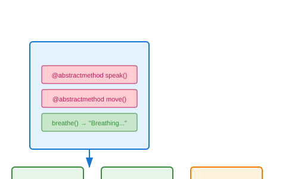

# Abstract Base Classes (ABC)

## Definition
Abstract Base Classes define a common interface for a group of subclasses. They use the `abc` module and `@abstractmethod` decorator to enforce implementation in concrete subclasses.

## Pros
- **Enforcement**: Prevents instantiation of incomplete classes
- **Documentation**: Clear contract for subclasses
- **Polymorphism**: Enables type checking with `isinstance()`
- **Registry**: Virtual subclasses via `register()`

## Cons
- **Complexity**: Additional boilerplate code
- **Inflexibility**: All abstract methods must be implemented
- **Runtime Only**: No compile-time enforcement
- **Overhead**: ABCMeta metaclass overhead

## Use Cases
- **Framework Base Classes**: Define extension points
- **Plugin Architectures**: Standard interfaces
- **Data Structures**: Abstract collections
- **Domain Models**: Enforce business rules

## Image


## Syntax
```python
from abc import ABC, abstractmethod

class Animal(ABC):
    @abstractmethod
    def speak(self):
        pass
    
    @abstractmethod
    def move(self):
        pass
    
    def breathe(self):  # Concrete method
        return "Breathing..."

class Dog(Animal):
    def speak(self):
        return "Woof!"
    
    def move(self):
        return "Running"

# dog = Animal()  # TypeError: Can't instantiate abstract class
dog = Dog()
print(dog.speak())   # Woof!
print(dog.breathe()) # Breathing...
print(isinstance(dog, Animal))  # True
```