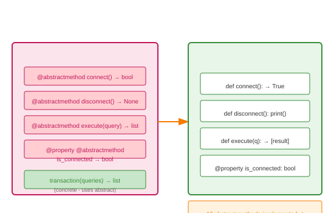

# Abstract Methods

## Definition
Abstract methods are methods declared in an abstract base class without implementation. Subclasses **must** override them. They use the `@abstractmethod` decorator.

## Pros
- **Contract Enforcement**: Compiler-like enforcement at runtime
- **Clear API**: Documents required methods
- **Flexibility**: Can have concrete methods alongside
- **Properties**: Can be abstract properties too

## Cons
- **All Must Implement**: No optional abstract methods
- **Inheritance Chain**: Each subclass must implement or be abstract
- **No Default**: Can't provide default implementation easily
- **Testing Burden**: Must test each implementation

## Use Cases
- **Template Method Pattern**: Define algorithm skeleton
- **Strategy Pattern**: Define strategy interface
- **Factory Methods**: Require creation methods
- **Lifecycle Hooks**: Initialize, cleanup, validate

## Image


## Syntax
```python
from abc import ABC, abstractmethod

class Database(ABC):
    @abstractmethod
    def connect(self) -> bool:
        """Establish connection"""
    
    @abstractmethod
    def disconnect(self) -> None:
        """Close connection"""
    
    @abstractmethod
    def execute(self, query: str) -> list:
        """Execute query, return results"""
    
    @property
    @abstractmethod
    def is_connected(self) -> bool:
        """Connection status"""
    
    # Concrete method using abstract ones
    def transaction(self, queries: list) -> list:
        if not self.is_connected:
            self.connect()
        results = []
        try:
            for q in queries:
                results.append(self.execute(q))
        finally:
            self.disconnect()
        return results

class PostgreSQLDatabase(Database):
    def __init__(self, host, port):
        self.host = host
        self.port = port
        self._connected = False
    
    def connect(self) -> bool:
        print(f"Connecting to PostgreSQL at {self.host}:{self.port}")
        self._connected = True
        return True
    
    def disconnect(self) -> None:
        print("Disconnecting from PostgreSQL")
        self._connected = False
    
    def execute(self, query: str) -> list:
        if not self._connected:
            raise RuntimeError("Not connected")
        print(f"Executing: {query}")
        return [{"result": "ok"}]
    
    @property
    def is_connected(self) -> bool:
        return self._connected

class MySQLDatabase(Database):
    def __init__(self, host, port):
        self.host = host
        self.port = port
        self._conn = None
    
    def connect(self) -> bool:
        print(f"Connecting to MySQL at {self.host}:{self.port}")
        self._conn = "mysql_connection"
        return True
    
    def disconnect(self) -> None:
        print("Disconnecting from MySQL")
        self._conn = None
    
    def execute(self, query: str) -> list:
        if not self._conn:
            raise RuntimeError("Not connected")
        print(f"MySQL executing: {query}")
        return [{"rows_affected": 1}]
    
    @property
    def is_connected(self) -> bool:
        return self._conn is not None

# Usage
for db_class in [PostgreSQLDatabase, MySQLDatabase]:
    db = db_class("localhost", 5432 if db_class == PostgreSQLDatabase else 3306)
    print(f"\n--- {db_class.__name__} ---")
    db.transaction(["BEGIN", "INSERT INTO users...", "COMMIT"])
```