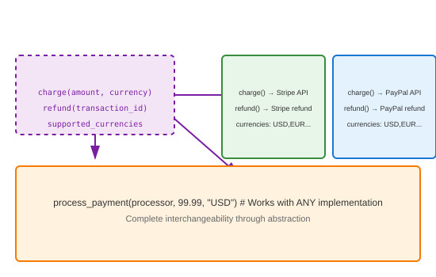

# Concrete Implementation

## Definition
Concrete implementation classes provide actual functionality for abstract interfaces. They inherit from abstract base classes or implement protocols, supplying all required method implementations.

## Pros
- **Completeness**: Fully functional, ready to use
- **Specialization**: Optimized for specific use cases
- **Interchangeability**: Swap implementations via abstraction
- **Testing**: Can test concrete behavior directly

## Cons
- **Coupling**: Tied to specific implementation details
- **Maintenance**: Changes may break abstraction contract
- **Complexity**: Real-world logic adds complexity
- **Duplication**: Common code may repeat across implementations

## Use Cases
- **Database Drivers**: PostgreSQL, MySQL, SQLite implementations
- **Payment Processors**: Stripe, PayPal, Square integrations
- **Storage Backends**: S3, Local, Azure Blob storage
- **Notification Channels**: Email, SMS, Push, Slack
- **Cache Providers**: Redis, Memcached, In-memory

## Image


## Syntax
```python
from abc import ABC, abstractmethod
from typing import Protocol

# Abstract interface
class PaymentProcessor(ABC):
    @abstractmethod
    def charge(self, amount: float, currency: str) -> dict:
        pass
    
    @abstractmethod
    def refund(self, transaction_id: str) -> bool:
        pass
    
    @property
    @abstractmethod
    def supported_currencies(self) -> list:
        pass

# Concrete implementations
class StripeProcessor(PaymentProcessor):
    def __init__(self, api_key: str):
        self.api_key = api_key
    
    def charge(self, amount: float, currency: str) -> dict:
        # Real implementation would call Stripe API
        return {
            "id": "ch_stripe_123",
            "amount": amount,
            "currency": currency,
            "status": "succeeded",
            "processor": "stripe"
        }
    
    def refund(self, transaction_id: str) -> bool:
        print(f"Stripe refunding {transaction_id}")
        return True
    
    @property
    def supported_currencies(self) -> list:
        return ["USD", "EUR", "GBP", "JPY", "CAD"]

class PayPalProcessor(PaymentProcessor):
    def __init__(self, client_id: str, secret: str):
        self.client_id = client_id
        self.secret = secret
    
    def charge(self, amount: float, currency: str) -> dict:
        return {
            "id": "paypal_456",
            "amount": amount,
            "currency": currency,
            "status": "completed",
            "processor": "paypal"
        }
    
    def refund(self, transaction_id: str) -> bool:
        print(f"PayPal refunding {transaction_id}")
        return True
    
    @property
    def supported_currencies(self) -> list:
        return ["USD", "EUR", "GBP", "AUD", "CAD"]

class SquareProcessor(PaymentProcessor):
    def __init__(self, access_token: str):
        self.access_token = access_token
    
    def charge(self, amount: float, currency: str) -> dict:
        return {
            "id": "sq_789",
            "amount": amount,
            "currency": currency,
            "status": "COMPLETED",
            "processor": "square"
        }
    
    def refund(self, transaction_id: str) -> bool:
        print(f"Square refunding {transaction_id}")
        return True
    
    @property
    def supported_currencies(self) -> list:
        return ["USD", "CAD", "AUD", "GBP", "EUR", "JPY"]

# Factory for interchangeability
class PaymentFactory:
    @staticmethod
    def create_processor(provider: str, **config) -> PaymentProcessor:
        processors = {
            "stripe": StripeProcessor,
            "paypal": PayPalProcessor,
            "square": SquareProcessor
        }
        if provider not in processors:
            raise ValueError(f"Unknown provider: {provider}")
        return processors[provider](**config)

# Usage - completely interchangeable
def process_payment(processor: PaymentProcessor, amount: float, currency: str):
    if currency not in processor.supported_currencies:
        raise ValueError(f"{processor.__class__.__name__} doesn't support {currency}")
    
    result = processor.charge(amount, currency)
    print(f"Charged: {result}")
    return result

# Swap implementations easily
for provider in ["stripe", "paypal", "square"]:
    print(f"\n--- {provider.upper()} ---")
    processor = PaymentFactory.create_processor(provider, api_key="test")
    process_payment(processor, 99.99, "USD")
```