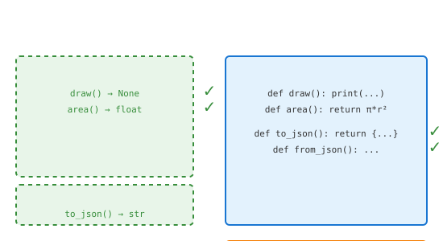

# Interfaces (Protocols)

## Definition
Interfaces define a contract that classes must follow. In Python, `typing.Protocol` (3.8+) enables structural subtyping - classes implement interfaces implicitly by having required methods.

## Pros
- **No Inheritance Required**: Classes don't need to inherit
- **Static Checking**: Works with type checkers (mypy, pyright)
- **Flexibility**: Duck typing with static verification
- **Composition**: Multiple protocols per class
- **Third-party**: Works with external classes

## Cons
- **Runtime Only**: No enforcement at runtime
- **Tooling Dependent**: Requires type checker for full benefit
- **Verbose**: Protocol definitions add code
- **Python 3.8+**: Not available in older versions

## Use Cases
- **Type Hints**: Improve IDE support and static analysis
- **Plugin Systems**: Define expected interfaces
- **Callbacks**: Specify callable signatures
- **Configuration**: Validate object capabilities
- **Testing**: Mock objects with correct interface

## Image


## Syntax
```python
from typing import Protocol, runtime_checkable

@runtime_checkable
class Drawable(Protocol):
    def draw(self) -> None: ...
    def area(self) -> float: ...

@runtime_checkable
class Serializable(Protocol):
    def to_json(self) -> str: ...
    def from_json(self, data: str) -> None: ...

class Circle:
    def __init__(self, radius: float):
        self.radius = radius
    
    def draw(self) -> None:
        print(f"Drawing circle r={self.radius}")
    
    def area(self) -> float:
        return 3.14159 * self.radius ** 2
    
    def to_json(self) -> str:
        return f'{{"type": "circle", "radius": {self.radius}}}'
    
    def from_json(self, data: str) -> None:
        import json
        d = json.loads(data)
        self.radius = d["radius"]

# Usage with type hints
def render(shape: Drawable) -> None:
    shape.draw()
    print(f"Area: {shape.area()}")

def save(obj: Serializable) -> None:
    print(f"Saving: {obj.to_json()}")

circle = Circle(5)
render(circle)  # Works - Circle implements Drawable
save(circle)    # Works - Circle implements Serializable

# Runtime checking
print(isinstance(circle, Drawable))     # True
print(issubclass(Circle, Drawable))     # True
```