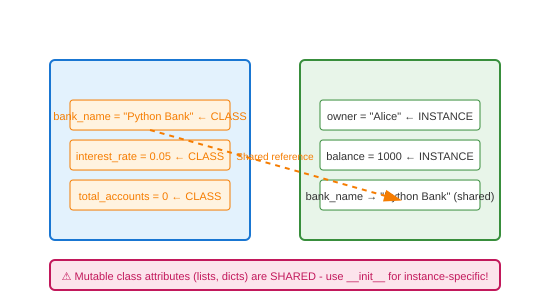

# Attributes (Instance vs Class)

## Definition
Attributes store data on objects. **Instance attributes** are unique to each object (defined in `__init__`). **Class attributes** are shared across all instances (defined in class body).

## Pros
- **Instance**: Isolated state per object
- **Class**: Memory efficient for shared data
- **Flexibility**: Mix both as needed
- **Default Values**: Class attrs provide defaults

## Cons
- **Mutation Trap**: Modifying mutable class attrs affects all
- **Shadowing**: Instance attrs hide class attrs
- **Confusion**: Hard to distinguish in code

## Use Cases
- **Instance**: name, email, balance, settings
- **Class**: constants, counters, default config, registry

## Image


## Syntax
```python
class Account:
    # Class attributes (shared)
    bank_name = "Python Bank"
    interest_rate = 0.05
    total_accounts = 0
    
    def __init__(self, owner, balance=0):
        # Instance attributes (unique)
        self.owner = owner
        self.balance = balance
        Account.total_accounts += 1
    
    def deposit(self, amount):
        self.balance += amount
    
    @classmethod
    def get_total(cls):
        return cls.total_accounts

# Usage
acc1 = Account("Alice", 1000)
acc2 = Account("Bob", 500)

# Instance attributes
print(acc1.owner)    # Alice
print(acc2.balance)  # 500

# Class attributes (accessible via instance or class)
print(acc1.bank_name)      # Python Bank
print(Account.interest_rate)  # 0.05

# Modifying class attribute - affects all
Account.interest_rate = 0.06
print(acc1.interest_rate)  # 0.06
print(acc2.interest_rate)  # 0.06

# Shadowing - creates instance attribute
acc1.bank_name = "My Bank"  # Only acc1 changed!
print(acc1.bank_name)  # My Bank
print(acc2.bank_name)  # Python Bank

# Mutable class attribute trap
class BadExample:
    tags = []  # Shared list!
    
b1 = BadExample()
b2 = BadExample()
b1.tags.append("tag1")
print(b2.tags)  # ['tag1'] - unexpected!

# Fix: use None default in __init__
class GoodExample:
    def __init__(self):
        self.tags = []  # Instance list