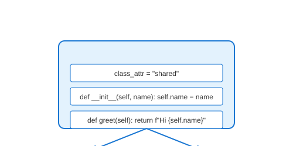

# Class Definition

## Definition
A class definition creates a new type blueprint using the `class` keyword. It defines the structure (attributes) and behavior (methods) that all instances will share.

## Pros
- **Template Creation**: Single definition for multiple objects
- **Namespace Isolation**: Class attributes don't pollute global scope
- **Inheritance Ready**: Can be extended by subclasses
- **Documentation**: Docstrings describe purpose

## Cons
- **No State**: Class itself doesn't hold instance data
- **Memory**: Class object consumes memory
- **Complexity**: Metaclasses add advanced complexity

## Use Cases
- Defining domain entities (User, Product)
- Creating reusable components
- Building frameworks and libraries
- Organizing related functionality

## Image


## Syntax
```python
class ClassName:
    """Docstring describing the class"""
    
    # Class attributes (shared by all instances)
    class_attribute = "shared value"
    
    def __init__(self, param):
        # Instance attributes (unique per object)
        self.instance_attr = param
    
    def instance_method(self):
        return f"Instance: {self.instance_attr}"
    
    @classmethod
    def class_method(cls):
        return f"Class: {cls.class_attribute}"
    
    @staticmethod
    def static_method():
        return "Static: no self/cls"

# Usage
obj = ClassName("value")
```