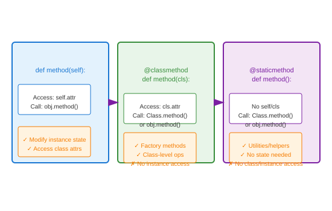

# Methods (Instance, Class, Static)

## Definition
Methods define behavior. **Instance methods** receive `self` (the object). **Class methods** receive `cls` (the class). **Static methods** receive neither - they're regular functions in class namespace.

## Pros
- **Instance**: Access/modify object state
- **Class**: Factory methods, class-level ops
- **Static**: Utility functions, organization
- **Polymorphism**: All support overriding

## Cons
- **Static**: No access to class/instance state
- **Class**: Can't access instance attributes
- **Overhead**: Method lookup vs function call

## Use Cases
- **Instance**: Business logic, state mutations
- **Class**: Alternative constructors, registry
- **Static**: Validation, conversion, helpers

## Image


## Syntax
```python
class Temperature:
    def __init__(self, celsius):
        self.celsius = celsius
    
    # Instance method - needs self
    def to_fahrenheit(self):
        return self.celsius * 9/5 + 32
    
    def __str__(self):
        return f"{self.celsius}°C"
    
    # Class method - factory pattern
    @classmethod
    def from_fahrenheit(cls, fahrenheit):
        celsius = (fahrenheit - 32) * 5/9
        return cls(celsius)
    
    @classmethod
    def freezing(cls):
        return cls(0)
    
    @classmethod
    def boiling(cls):
        return cls(100)
    
    # Static method - utility
    @staticmethod
    def is_absolute_zero(celsius):
        return celsius <= -273.15
    
    @staticmethod
    def c_to_k(celsius):
        return celsius + 273.15

# Usage
temp = Temperature(25)
print(temp.to_fahrenheit())  # 77.0
print(temp)  # 25°C

# Class methods as alternative constructors
cold = Temperature.from_fahrenheit(32)
print(cold)  # 0.0°C

ice = Temperature.freezing()
steam = Temperature.boiling()

# Static methods
print(Temperature.is_absolute_zero(-300))  # True
print(Temperature.c_to_k(0))  # 273.15

# All callable on instances too
print(temp.is_absolute_zero(100))  # False
```