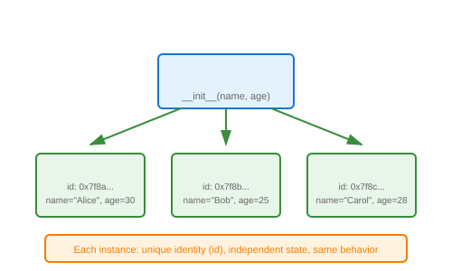

# Object Creation (Instantiation)

## Definition
Object creation (instantiation) is the process of creating a concrete instance from a class blueprint. Each object has its own identity, state, and behavior.

## Pros
- **Isolation**: Each object maintains independent state
- **Identity**: Unique `id()` for each instance
- **Flexibility**: Create as many instances as needed
- **Lifecycle Control**: Constructor/destructor hooks

## Cons
- **Memory**: Each instance consumes memory
- **Overhead**: Creation/destruction has cost
- **Garbage Collection**: Cleanup non-deterministic

## Use Cases
- Creating multiple similar entities
- Stateful operations (database connections)
- Representing real-world objects
- Plugin instances with different configs

## Image


## Syntax
```python
class Person:
    def __init__(self, name, age):
        self.name = name
        self.age = age
    
    def greet(self):
        return f"Hi, I'm {self.name}"

# Standard instantiation
person1 = Person("Alice", 30)
person2 = Person("Bob", 25)

# Each has own state
print(person1.name)  # Alice
print(person2.name)  # Bob

# Identity check
print(id(person1) != id(person2))  # True

# Dynamic attributes
person1.email = "alice@example.com"  # Only person1 has this

# Factory pattern
def create_person(data):
    return Person(data["name"], data["age"])

person3 = create_person({"name": "Carol", "age": 28})
```