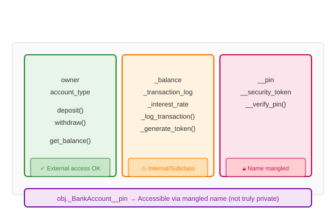

# Access Modifiers

## Definition
Access modifiers control visibility of class members. Python uses conventions rather than enforcement: public (no prefix), protected (`_single`), private (`__double`).

## Pros
- **Clear Intent**: Signals intended usage to developers
- **Namespace Management**: Reduces attribute collisions
- **Subclass Safety**: Protected members for inheritance
- **Name Mangling**: Private attributes avoid subclass conflicts

## Cons
- **No Enforcement**: All accessible at runtime
- **Convention Only**: Relies on developer discipline
- **Testing Difficulty**: Harder to test private methods
- **Debugging**: Name mangling obscures names

## Use Cases
- **Public**: API methods, constants
- **Protected (`_`)**: Internal helpers, subclass extensions
- **Private (`__`)**: Implementation details, avoid collisions

## Image


## Syntax
```python
class BankAccount:
    def __init__(self, owner, balance):
        # Public - part of API
        self.owner = owner
        self.account_type = "checking"
        
        # Protected - internal use, subclass access
        self._balance = balance
        self._transaction_log = []
        self._interest_rate = 0.03
        
        # Private - implementation detail, name mangled
        self.__pin = "0000"
        self.__security_token = self._generate_token()
    
    # Public method
    def deposit(self, amount):
        if amount > 0:
            self._balance += amount
            self._log_transaction("deposit", amount)
    
    # Protected method - for subclasses
    def _log_transaction(self, type, amount):
        self._transaction_log.append({
            "type": type, "amount": amount, "balance": self._balance
        })
    
    def _generate_token(self):
        import hashlib, time
        return hashlib.md5(f"{self.owner}{time.time()}".encode()).hexdigest()[:16]
    
    # Private method - internal only
    def __verify_pin(self, pin):
        return pin == self.__pin
    
    # Public method using private
    def withdraw(self, amount, pin):
        if not self.__verify_pin(pin):
            raise ValueError("Invalid PIN")
        if amount <= self._balance:
            self._balance -= amount
            self._log_transaction("withdraw", amount)
            return True
        return False
    
    # Property for controlled access
    @property
    def balance(self):
        return self._balance

class SavingsAccount(BankAccount):
    def __init__(self, owner, balance, interest_rate=0.05):
        super().__init__(owner, balance)
        self._interest_rate = interest_rate  # Access protected
    
    def apply_interest(self):
        interest = self._balance * self._interest_rate
        self._balance += interest
        self._log_transaction("interest", interest)

# Usage
acc = BankAccount("Alice", 1000)
print(acc.owner)           # Public: OK
print(acc._balance)        # Protected: Works but discouraged
print(acc.balance)         # Property: Preferred

# Private access (name mangling)
print(acc._BankAccount__pin)        # Works: "0000"
print(acc._BankAccount__security_token)  # Works

# SavingsAccount can access protected
savings = SavingsAccount("Bob", 5000)
savings.apply_interest()
print(savings.balance)

# All attributes visible
print([a for a in dir(acc) if not a.startswith('__') or a.endswith('__')])
```