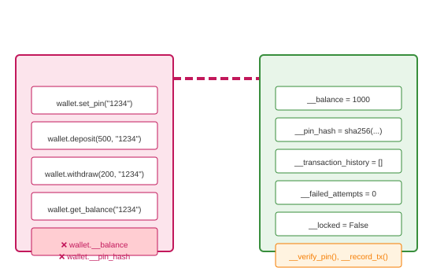

# Data Hiding

## Definition
Data hiding is the principle of restricting direct access to an object's internal state, exposing only a controlled public interface. It combines private attributes, properties, and methods to achieve true encapsulation.

## Pros
- **Integrity**: Impossible to put object in invalid state
- **Security**: Sensitive data (passwords, tokens) protected
- **Flexibility**: Complete freedom to change implementation
- **Abstraction**: Users see only what they need
- **Maintainability**: Localized changes, fewer side effects

## Cons
- **Verbosity**: More code for access control
- **Performance**: Indirect access overhead
- **Complexity**: Can over-engineer simple classes
- **Testing**: Need proper test interfaces
- **Python Limits**: Convention-based, not enforced

## Use Cases
- **Security**: Credentials, encryption keys, tokens
- **Invariants**: Balance never negative, valid dates
- **Complex State**: Multi-field consistency
- **External Resources**: File handles, connections
- **Audit Requirements**: Track all modifications

## Image


## Syntax
```python
class SecureWallet:
    def __init__(self, owner, initial_balance=0):
        self._owner = owner
        self.__balance = max(0, initial_balance)
        self.__pin_hash = None
        self.__transaction_history = []
        self.__failed_attempts = 0
        self.__locked = False
    
    # Public interface only
    def set_pin(self, pin):
        if self.__pin_hash is not None:
            raise PermissionError("PIN already set")
        if not (4 <= len(pin) <= 8 and pin.isdigit()):
            raise ValueError("PIN must be 4-8 digits")
        import hashlib
        self.__pin_hash = hashlib.sha256(pin.encode()).hexdigest()
    
    def verify_pin(self, pin):
        if self.__locked:
            raise PermissionError("Wallet locked - too many failed attempts")
        
        import hashlib
        pin_hash = hashlib.sha256(pin.encode()).hexdigest()
        
        if pin_hash == self.__pin_hash:
            self.__failed_attempts = 0
            return True
        else:
            self.__failed_attempts += 1
            if self.__failed_attempts >= 3:
                self.__locked = True
                raise PermissionError("Wallet locked - too many failed attempts")
            return False
    
    def deposit(self, amount, pin):
        if not self.verify_pin(pin):
            raise ValueError("Invalid PIN")
        if amount <= 0:
            raise ValueError("Amount must be positive")
        self.__balance += amount
        self.__record_transaction("deposit", amount)
        return self.__balance
    
    def withdraw(self, amount, pin):
        if not self.verify_pin(pin):
            raise ValueError("Invalid PIN")
        if amount <= 0:
            raise ValueError("Amount must be positive")
        if amount > self.__balance:
            raise ValueError("Insufficient funds")
        self.__balance -= amount
        self.__record_transaction("withdraw", amount)
        return self.__balance
    
    def get_balance(self, pin):
        if not self.verify_pin(pin):
            raise ValueError("Invalid PIN")
        return self.__balance
    
    def get_statement(self, pin):
        if not self.verify_pin(pin):
            raise ValueError("Invalid PIN")
        return {
            "owner": self._owner,
            "balance": self.__balance,
            "transactions": tuple(self.__transaction_history)
        }
    
    def change_pin(self, old_pin, new_pin):
        if not self.verify_pin(old_pin):
            raise ValueError("Invalid current PIN")
        if not (4 <= len(new_pin) <= 8 and new_pin.isdigit()):
            raise ValueError("PIN must be 4-8 digits")
        import hashlib
        self.__pin_hash = hashlib.sha256(new_pin.encode()).hexdigest()
        return True
    
    # Internal methods (not public)
    def __record_transaction(self, type, amount):
        from datetime import datetime
        self.__transaction_history.append({
            "type": type,
            "amount": amount,
            "balance": self.__balance,
            "timestamp": datetime.now().isoformat()
        })
    
    # No direct access to balance, pin, history, lock state


class ImmutableConfig:
    """Truly immutable after initialization"""
    def __init__(self, **settings):
        self.__settings = dict(settings)
        self.__frozen = True
    
    def __setattr__(self, name, value):
        if getattr(self, '_ImmutableConfig__frozen', False):
            raise AttributeError(f"Cannot modify frozen config: {name}")
        super().__setattr__(name, value)
    
    def __getattr__(self, name):
        if name in self.__settings:
            return self.__settings[name]
        raise AttributeError(f"No setting: {name}")
    
    def get(self, key, default=None):
        return self.__settings.get(key, default)
    
    def as_dict(self):
        return self.__settings.copy()


# Usage
if __name__ == "__main__":
    print("=== SecureWallet ===")
    wallet = SecureWallet("Alice", 1000)
    wallet.set_pin("1234")
    
    print(f"Balance: {wallet.get_balance('1234')}")
    wallet.deposit(500, '1234')
    print(f"After deposit: {wallet.get_balance('1234')}")
    wallet.withdraw(200, '1234')
    print(f"After withdraw: {wallet.get_balance('1234')}")
    
    stmt = wallet.get_statement('1234')
    print(f"Transactions: {len(stmt['transactions'])}")
    
    # Security features
    print("\n--- Failed attempts ---")
    for i in range(3):
        try:
            wallet.get_balance("wrong")
        except Exception as e:
            print(f"Attempt {i+1}: {e}")
    
    print("\n=== ImmutableConfig ===")
    config = ImmutableConfig(
        api_key="secret123",
        max_retries=3,
        timeout=30,
        debug=False
    )
    
    print(f"API Key: {config.api_key}")
    print(f"Timeout: {config.timeout}")
    print(f"All settings: {config.as_dict()}")
    
    try:
        config.timeout = 60
    except AttributeError as e:
        print(f"Error: {e}")
    
    try:
        config.new_setting = "value"
    except AttributeError as e:
        print(f"Error: {e}")