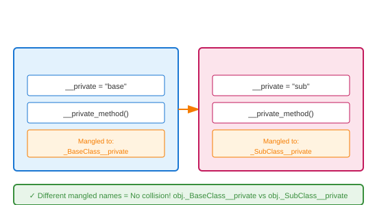

# Private Attributes (Name Mangling)

## Definition
Private attributes in Python use double underscore prefix (`__attr`). Python performs name mangling: `__attr` becomes `_ClassName__attr`, making them harder to access accidentally but not truly private.

## Pros
- **Collision Avoidance**: Prevents subclass attribute conflicts
- **Intent Signaling**: Clear "internal use only" marker
- **Namespace Isolation**: Each class gets unique mangled names
- **Debugging Aid**: Mangled names identify owning class

## Cons
- **Not Truly Private**: Accessible via mangled name
- **Inheritance Issues**: Subclasses can't easily access
- **Testing Difficulty**: Harder to mock/test private methods
- **Serialization**: Pickle/json may not handle correctly

## Use Cases
- **Internal State**: Implementation details
- **Subclass Safety**: Prevent accidental overrides
- **Mixin Classes**: Avoid conflicts in multiple inheritance
- **Library Code**: Protect internal APIs

## Image


## Syntax
```python
class BaseClass:
    def __init__(self):
        self.public = "public"
        self._protected = "protected"
        self.__private = "private"
    
    def public_method(self):
        return self.__private_method()
    
    def __private_method(self):
        return "BaseClass private"
    
    def _protected_method(self):
        return "BaseClass protected"

class SubClass(BaseClass):
    def __init__(self):
        super().__init__()
        self.__private = "subclass private"  # Different attribute!
        self._protected = "subclass protected"  # Overrides parent
    
    def access_private(self):
        # Can't access parent's __private directly
        # print(self.__private)  # This is SubClass's __private
        # print(self.__private_method())  # AttributeError!
        pass
    
    def __private_method(self):
        return "SubClass private"

# Demonstration
base = BaseClass()
sub = SubClass()

print("=== BaseClass ===")
print(f"public: {base.public}")
print(f"_protected: {base._protected}")
# print(base.__private)  # AttributeError!
print(f"_BaseClass__private: {base._BaseClass__private}")
print(f"public_method(): {base.public_method()}")

print("\n=== SubClass ===")
print(f"public: {sub.public}")
print(f"_protected: {sub._protected}")  # Overridden
print(f"_SubClass__private: {sub._SubClass__private}")
print(f"_BaseClass__private: {sub._BaseClass__private}")  # Parent's still exists!

# Name mangling in action
print("\n=== Name Mangling ===")
print("BaseClass attributes:", [a for a in dir(base) if 'private' in a or 'Private' in a])
print("SubClass attributes:", [a for a in dir(sub) if 'private' in a or 'Private' in a])

# Practical use: preventing accidental override
class Counter:
    def __init__(self):
        self.__count = 0  # Truly internal
    
    def increment(self):
        self.__count += 1
    
    def get_count(self):
        return self.__count

class BadCounter(Counter):
    def __init__(self):
        super().__init__()
        self.__count = 100  # Creates _BadCounter__count, not touching parent!

c = Counter()
c.increment()
c.increment()
print(f"\nCounter: {c.get_count()}")  # 2

bc = BadCounter()
bc.increment()
print(f"BadCounter: {bc.get_count()}")  # Still 2 (parent's __count untouched)
print(f"BadCounter own: {bc._BadCounter__count}")  # 101
```