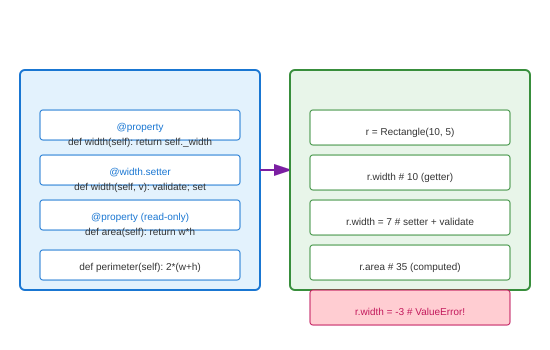

# Property Decorators

## Definition
The `@property` decorator transforms methods into managed attributes, providing getter/setter/deleter functionality with clean attribute-like syntax. It's Python's idiomatic way to implement encapsulation.

## Pros
- **Clean Syntax**: Access like attributes, not methods
- **Validation**: Intercept set operations
- **Computed Properties**: Derived values without storage
- **Backward Compatibility**: Convert attributes to properties later
- **Caching**: Lazy evaluation with memoization

## Cons
- **Performance**: Method call overhead per access
- **Complexity**: Can hide expensive operations
- **Inheritance**: Subclass property override nuances
- **Debugging**: Harder to trace property access

## Use Cases
- **Validation**: Type, range, format checking
- **Computed Fields**: Area from dimensions, full name from parts
- **Lazy Loading**: Expensive initialization on demand
- **Read-Only**: Immutable attributes after init
- **Deprecation**: Warn on access to old attributes

## Image


## Syntax
```python
class Rectangle:
    def __init__(self, width, height):
        self._width = width
        self._height = height
    
    @property
    def width(self):
        return self._width
    
    @width.setter
    def width(self, value):
        if value <= 0:
            raise ValueError("Width must be positive")
        self._width = value
    
    @property
    def height(self):
        return self._height
    
    @height.setter
    def height(self, value):
        if value <= 0:
            raise ValueError("Height must be positive")
        self._height = value
    
    # Read-only computed properties
    @property
    def area(self):
        return self._width * self._height
    
    @property
    def perimeter(self):
        return 2 * (self._width + self._height)
    
    @property
    def is_square(self):
        return self._width == self._height


class UserProfile:
    def __init__(self, first_name, last_name, email):
        self._first_name = first_name
        self._last_name = last_name
        self._email = email
        self._cache = {}
    
    @property
    def first_name(self):
        return self._first_name
    
    @first_name.setter
    def first_name(self, value):
        self._first_name = value.strip().title()
        self._cache.clear()  # Invalidate cache
    
    @property
    def last_name(self):
        return self._last_name
    
    @last_name.setter
    def last_name(self, value):
        self._last_name = value.strip().title()
        self._cache.clear()
    
    @property
    def full_name(self):
        # Computed property
        return f"{self._first_name} {self._last_name}"
    
    @property
    def initials(self):
        return f"{self._first_name[0]}.{self._last_name[0]}."
    
    @property
    def email(self):
        return self._email
    
    @email.setter
    def email(self, value):
        if "@" not in value:
            raise ValueError("Invalid email")
        self._email = value.lower()
    
    # Lazy-loaded property with caching
    @property
    def expensive_computation(self):
        if 'expensive' not in self._cache:
            print("  Computing expensive operation...")
            self._cache['expensive'] = sum(i**2 for i in range(100000))
        return self._cache['expensive']
    
    # Property with deleter
    @property
    def temporary_data(self):
        return self._cache.get('temp')
    
    @temporary_data.setter
    def temporary_data(self, value):
        self._cache['temp'] = value
    
    @temporary_data.deleter
    def temporary_data(self):
        self._cache.pop('temp', None)


class Config:
    """Property for backward compatibility"""
    def __init__(self):
        self._settings = {}
    
    @property
    def debug_mode(self):
        return self._settings.get('debug', False)
    
    @debug_mode.setter
    def debug_mode(self, value):
        self._settings['debug'] = bool(value)
    
    # Deprecated property
    @property
    def verbose(self):
        import warnings
        warnings.warn("verbose is deprecated, use debug_mode", DeprecationWarning)
        return self.debug_mode
    
    @verbose.setter
    def verbose(self, value):
        import warnings
        warnings.warn("verbose is deprecated, use debug_mode", DeprecationWarning)
        self.debug_mode = value


# Usage
if __name__ == "__main__":
    print("=== Rectangle ===")
    r = Rectangle(10, 5)
    print(f"Width: {r.width}, Height: {r.height}")
    print(f"Area: {r.area}, Perimeter: {r.perimeter}")
    print(f"Is square: {r.is_square}")
    
    r.width = 7
    print(f"After width=7: Area={r.area}")
    
    try:
        r.height = -3
    except ValueError as e:
        print(f"Error: {e}")
    
    print("\n=== UserProfile ===")
    u = UserProfile("john", "doe", "JOHN@EXAMPLE.COM")
    print(f"Full name: {u.full_name}")
    print(f"Initials: {u.initials}")
    print(f"Email: {u.email}")
    
    u.first_name = "jane"
    print(f"After change: {u.full_name}")
    
    print("\nFirst access (computes):")
    val1 = u.expensive_computation
    print(f"Result: {val1}")
    
    print("Second access (cached):")
    val2 = u.expensive_computation
    print(f"Result: {val2}")
    
    print("\n=== Config (deprecation) ===")
    c = Config()
    c.debug_mode = True
    print(f"Debug mode: {c.debug_mode}")
    # c.verbose  # Would show deprecation warning