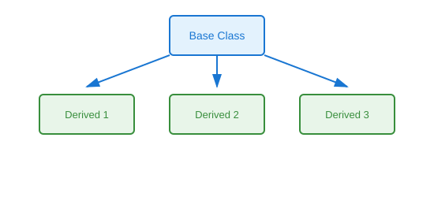

# Hierarchical Inheritance

## Definition
Multiple derived classes inherit from a single base class, creating a tree-like structure where siblings share common functionality from the parent but implement their own specialized behaviors.

## Pros
- Shared base functionality across siblings
- Clear separation of concerns
- Easy to add new child classes
- Promotes DRY principle
- Natural for categorization/taxonomy

## Cons
- Siblings cannot share code with each other directly
- Base class changes affect all children
- Can become unwieldy with many children
- Limited cross-sibling reuse
- May need refactoring to composition

## Use Cases
- Shape hierarchies (Circle, Rectangle, Triangle from Shape)
- Employee types (Manager, Developer, Designer from Employee)
- Payment processors (CreditCard, PayPal, Crypto from PaymentMethod)
- Notification channels (Email, SMS, Push from Notification)
- Plugin/category systems

## Image


## Syntax
```python
class BaseClass:
    pass

class DerivedClass1(BaseClass):
    pass

class DerivedClass2(BaseClass):
    pass

class DerivedClass3(BaseClass):
    pass
```