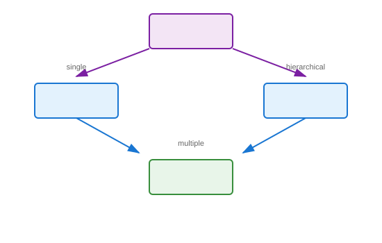

# Hybrid Inheritance

## Definition
A combination of two or more types of inheritance (single, multiple, multilevel, hierarchical) in a single class hierarchy, enabling complex real-world modeling through mixed inheritance patterns.

## Pros
- Maximum flexibility in modeling
- Combines benefits of multiple patterns
- Realistic representation of complex domains
- Powerful abstraction capabilities
- Supports sophisticated design patterns

## Cons
- Highest complexity of all types
- Difficult to understand and maintain
- MRO becomes critical and complex
- Diamond problem likely
- High coupling across hierarchy
- Debugging becomes challenging

## Use Cases
- Complex domain models (biological taxonomy with traits)
- Game entity systems (Entity → Character → Player + Flyer + Swimmer)
- Framework internals
- Multi-interface implementations
- Legacy system integration layers

## Image


## Syntax
```python
class A:
    pass

class B(A):        # Single inheritance
    pass

class C(A):        # Hierarchical inheritance
    pass

class D(B, C):     # Multiple inheritance (creates hybrid)
    pass
```