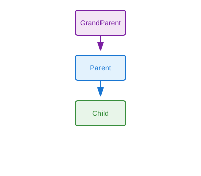

# Multilevel Inheritance

## Definition
A class inherits from a derived class, creating a chain of inheritance across multiple levels (grandparent → parent → child), where each level adds or specializes functionality.

## Pros
- Progressive specialization at each level
- Clear logical hierarchy
- Reuses code across multiple levels
- Natural modeling of taxonomies
- Easy to extend incrementally

## Cons
- Deep hierarchies become fragile
- Changes at top affect all descendants
- Harder to trace method origins
- Tight coupling across levels
- Violates composition over inheritance principle

## Use Cases
- Domain modeling (Animal → Mammal → Dog → Labrador)
- UI component hierarchies (Widget → Button → SubmitButton)
- Framework layering
- Progressive feature enhancement
- Template method pattern implementations

## Image


## Syntax
```python
class GrandParent:
    pass

class Parent(GrandParent):
    pass

class Child(Parent):
    pass
```