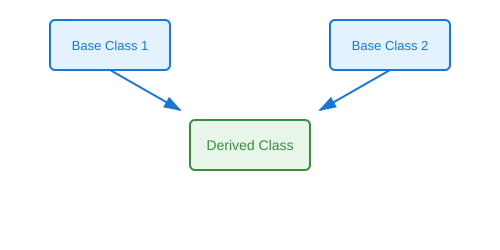

# Multiple Inheritance

## Definition
A derived class inherits from two or more base classes simultaneously, combining features from multiple parent classes into a single child class.

## Pros
- Combines functionality from multiple classes
- Promotes code reuse across unrelated classes
- Enables mixin patterns for cross-cutting concerns
- Flexible composition of behaviors
- Models complex real-world relationships

## Cons
- Complexity in method resolution (MRO)
- Diamond problem potential
- Tight coupling to multiple parents
- Harder to debug and maintain
- Increased cognitive load

## Use Cases
- Mixin classes (logging, serialization, validation)
- Combining independent interfaces
- Plugin architectures
- Adapter patterns
- Multiple interface implementation

## Image


## Syntax
```python
class BaseClass1:
    pass

class BaseClass2:
    pass

class DerivedClass(BaseClass1, BaseClass2):
    # Inherits from both BaseClass1 and BaseClass2
    pass
```