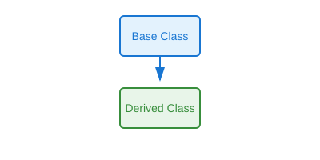

# Single Inheritance

## Definition
A derived class inherits from exactly one base class. This is the simplest form of inheritance where a child class acquires properties and behaviors from a single parent class.

## Pros
- Simple to understand and implement
- Clear hierarchy with no ambiguity
- Easy to debug and maintain
- No method resolution conflicts
- Memory efficient

## Cons
- Limited code reuse (only one parent)
- Cannot combine features from multiple classes
- Rigid hierarchy structure
- May lead to deep inheritance chains

## Use Cases
- Extending a base class with specialized functionality
- Creating variants of a single concept (e.g., Dog → GoldenRetriever)
- Simple is-a relationships
- Framework extension points

## Image


## Syntax
```python
class BaseClass:
    # Base class attributes and methods
    pass

class DerivedClass(BaseClass):
    # Derived class inherits from BaseClass
    pass
```