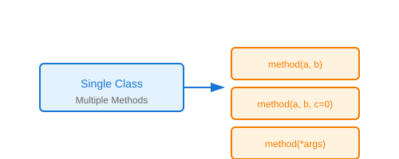

# Compile-Time Polymorphism

## Definition
Compile-time polymorphism (static polymorphism) is resolved at compile time. The method to be executed is determined by the method signature (name and parameters) during compilation.

## Pros
- **Performance**: No runtime overhead for method resolution
- **Early Binding**: Errors caught at compile time
- **Clear Intent**: Method signatures explicitly show variations
- **Optimization**: Compiler can optimize calls

## Cons
- **Limited Flexibility**: Fixed at compile time
- **No Runtime Adaptation**: Cannot change behavior dynamically
- **Verbosity**: Multiple method signatures needed
- **Python Limitation**: Not natively supported (simulated via default args/*args)

## Use Cases
- Mathematical operations with different parameter counts
- Builder patterns with optional parameters
- Utility functions with flexible signatures
- Constructor overloading simulation

## Image


## Syntax
```python
# Python simulates via default arguments
class Calculator:
    def add(self, a, b, c=0):
        return a + b + c
    
    def multiply(self, *args):
        result = 1
        for num in args:
            result *= num
        return result

calc = Calculator()
calc.add(2, 3)       # 5
calc.add(2, 3, 4)    # 9
calc.multiply(2, 3)  # 6
calc.multiply(2, 3, 4)  # 24
```