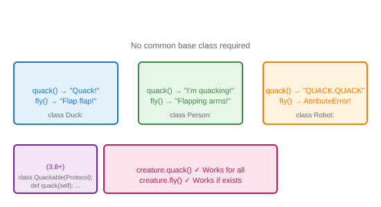

# Duck Typing

## Definition
Duck typing is a concept where an object's suitability is determined by the presence of certain methods and properties, rather than its type or inheritance hierarchy. "If it walks like a duck and quacks like a duck, it's a duck."

## Pros
- **Maximum Flexibility**: No inheritance required
- **Loose Coupling**: Objects only need required methods
- **Easy Testing**: Mock objects just need same interface
- **Pythonic**: Aligns with Python's dynamic nature
- **Third-party Integration**: Works with any compatible object

## Cons
- **Runtime Errors**: Missing methods cause AttributeError
- **No Contract Enforcement**: Interface not explicit
- **Documentation Burden**: Expected methods must be documented
- **IDE Support Limited**: Harder for static analysis
- **Refactoring Risk**: Method renames break callers silently

## Use Cases
- Protocol/interface implementations
- Testing with mocks/stubs
- Plugin architectures
- Generic algorithms (sort, map, filter)
- File-like objects (anything with read/write)

## Image


## Syntax
```python
# No common base class needed
class Duck:
    def quack(self):
        return "Quack!"
    def fly(self):
        return "Flap flap!"

class Person:
    def quack(self):
        return "I'm quacking like a duck!"
    def fly(self):
        return "Flapping arms!"

class Robot:
    def quack(self):
        return "QUACK.QUACK"
    # No fly method!

def duck_test(creature):
    print(creature.quack())
    if hasattr(creature, 'fly'):
        print(creature.fly())
    else:
        print("This creature can't fly")

duck_test(Duck())    # Quack! / Flap flap!
duck_test(Person())  # I'm quacking... / Flapping arms!
duck_test(Robot())   # QUACK.QUACK / This creature can't fly

# Python protocols (3.8+) for static checking
from typing import Protocol

class Quackable(Protocol):
    def quack(self) -> str: ...
    def fly(self) -> str: ...
```