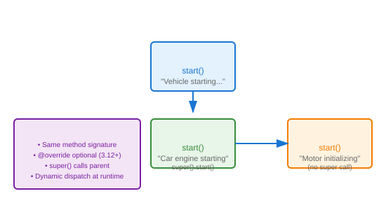

# Method Overriding

## Definition
Method overriding allows a subclass to provide a specific implementation of a method already defined in its parent class. The overridden method must have the same name and signature.

## Pros
- **Specialization**: Customize behavior for specific types
- **Polymorphic Calls**: Parent reference calls child implementation
- **Code Reuse**: Inherit structure, override only what's needed
- **Liskov Substitution**: Maintains interface contract

## Cons
- **Fragile Base Class**: Parent changes break children
- **Hidden Behavior**: Overridden methods not obvious
- **Super Calls**: Forgetting super() breaks chain
- **Testing Complexity**: Must test each override

## Use Cases
- Template Method Pattern
- Customizing framework behavior
- Adding validation/logging to inherited methods
- Changing algorithm implementation

## Image


## Syntax
```python
class Vehicle:
    def start(self):
        return "Vehicle starting..."
    
    def stop(self):
        return "Vehicle stopping"

class Car(Vehicle):
    def start(self):
        return "Car engine starting with key"
    
    def stop(self):
        super().stop()
        return "Car stopped, parking brake engaged"

class ElectricCar(Car):
    def start(self):
        return "Electric motor initializing silently"
    
    def charge(self):
        return "Battery charging..."

vehicles = [Vehicle(), Car(), ElectricCar()]
for v in vehicles:
    print(v.start())
    print(v.stop())
    print()
```