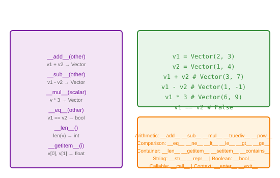

# Polymorphism in Operators

## Definition
Operator polymorphism (operator overloading) allows defining how operators (+, -, *, ==, etc.) behave with custom objects. Python uses special methods (dunder methods) to implement this.

## Pros
- **Natural Syntax**: Use familiar operators with custom types
- **Readability**: Code reads like mathematical expressions
- **Consistency**: Built-in types and custom types behave similarly
- **Pythonic**: Expected behavior for numeric/container types

## Cons
- **Confusion Risk**: Unexpected operator behavior
- **Performance**: Method call overhead vs built-in
- **Complexity**: Many dunder methods to implement
- **Immutability Issues**: += vs + behavior differences

## Use Cases
- Mathematical objects (Vector, Matrix, Complex)
- Custom containers (enhanced list/dict)
- Domain-specific languages
- Data classes with comparison
- String-like objects

## Image


## Syntax
```python
class Vector:
    def __init__(self, x, y):
        self.x = x
        self.y = y
    
    # Addition
    def __add__(self, other):
        return Vector(self.x + other.x, self.y + other.y)
    
    # Subtraction
    def __sub__(self, other):
        return Vector(self.x - other.x, self.y - other.y)
    
    # Multiplication (scalar)
    def __mul__(self, scalar):
        return Vector(self.x * scalar, self.y * scalar)
    
    # Equality
    def __eq__(self, other):
        return self.x == other.x and self.y == other.y
    
    # String representation
    def __repr__(self):
        return f"Vector({self.x}, {self.y})"
    
    # Length (magnitude)
    def __len__(self):
        return int((self.x**2 + self.y**2)**0.5)
    
    # Indexing
    def __getitem__(self, index):
        if index == 0: return self.x
        if index == 1: return self.y
        raise IndexError("Vector index out of range")

v1 = Vector(2, 3)
v2 = Vector(1, 4)

print(v1 + v2)      # Vector(3, 7)
print(v1 - v2)      # Vector(1, -1)
print(v1 * 3)       # Vector(6, 9)
print(v1 == v2)     # False
print(len(v1))      # 3
print(v1[0], v1[1]) # 2 3

# Common operator methods:
# __add__, __sub__, __mul__, __truediv__, __floordiv__, __mod__, __pow__
# __eq__, __ne__, __lt__, __le__, __gt__, __ge__
# __len__, __getitem__, __setitem__, __delitem__, __contains__
# __str__, __repr__, __bool__, __hash__
# __call__, __iter__, __next__, __enter__, __exit__
```