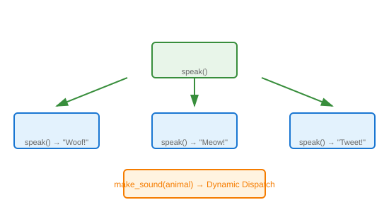

# Runtime Polymorphism

## Definition
Runtime polymorphism (dynamic polymorphism) is resolved at runtime. The method to be executed is determined by the actual object type, not the reference type, enabling dynamic behavior.

## Pros
- **Flexibility**: Behavior determined at runtime
- **Extensibility**: New subclasses work without code changes
- **Dynamic Dispatch**: Proper method called based on actual object
- **Interface Compliance**: Enforces common interface across types

## Cons
- **Performance Cost**: Dynamic lookup overhead
- **Runtime Errors**: Type mismatches caught late
- **Debugging Complexity**: Harder to trace execution flow
- **Memory Overhead**: VTable/virtual method table storage

## Use Cases
- Inheritance hierarchies with shared interface
- Plugin/extension systems
- Strategy pattern implementations
- Framework callback mechanisms
- Collection processing with polymorphic elements

## Image


## Syntax
```python
class Animal:
    def speak(self):
        return "Animal sound"

class Dog(Animal):
    def speak(self):
        return "Woof!"

class Cat(Animal):
    def speak(self):
        return "Meow!"

def make_sound(animal: Animal):
    print(animal.speak())

make_sound(Dog())  # Woof!
make_sound(Cat())  # Meow!
```